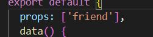

# 사용한 라이브러리

1. [InfiniteLoading](https://vue3-infinite-loading.netlify.app/) : vue3 무한스크롤 라이브러리. load라는 함수를 정의하여 사용한다. 
   한 번 내려가면 더 로딩이 안 될 때가 있어서(인식을 못하는듯?) 임의로 block이라는 클래스의 div를 만들어 밑에서부터 띄워준다.
   
   

2. [Vue3ChartJs](https://github.com/J-T-McC/vue3-chartjs) : vue3 chart.js 라이브러리. 변수를 v-bind 걸어 사용한다.
   차트 안에 텍스트를 넣어보려 했지만 사용법 미숙으로 결국 넣지 못했다.

3. [Flipbook](https://www.npmjs.com/package/flipbook-vue) : 책 효과. turn.js는 vue3 지원을 안해줘서 사용함.
   더빙 오디오를 넣어보려 했지만 사용법 미숙으로 실패

4. [lodash](https://lodash.com/) : 다양한 기능(랜덤 함수 사용했음). 너무좋음

# 인게임

1. 내 덱을 가져오고, vuex에 저장한 상대 덱도 가져와서 변수에 저장. (로딩창)

2. 게임 시작 포스트요청을 보내고 스킬을 랜덤으로 배정, gameStart 함수 호출 (로딩 끝) 

3. 게임을 시작하면 덱 리스트에서 0번째 요소를 현재 독초몬에 넣고 현재 타입을 받아와서 변수에 저장(체력바 색깔에 사용)하고 상성을 계산 후 attack 함수 호출
   삼항연산자를 사용하여 독초몬을 중앙으로 이동시킴(inGround)
   

4. isAttack을 true로 만들어 두 독초몬을 부딛히게 하고 로대시를 사용해 랜덤으로 데미지 계산.

5. 계산한 데미지에 상성 데미지를 추가함(이 함수를 상성체크 함수보다 먼저 만들어서 type을 보며 체크하는데 이미 상성을 계산해놔서 이렇게 길게 필요 없을 듯)

6. 만약에 스킬을 사용하였다면(nowUseSkill) 스킬까지 계산하여 데미지 산정 후 judged 함수 호출

7. 계산한 데미지를 활용하여 currentHp를 깎고 로그를 보냄, 만약 스킬을 사용했다면 스킬을 이제 못쓰게 isUseSkill을 true로 바꿔줌.

8. 나와 상대의 currentHp를 모두 비교하여 내가 죽었는지 상대가 죽었는지 둘 다 죽거나 살았는지 if문으로 나눔.

9. isDead_myDockCho 라는 다 false로 된 리스트를 indexOf 매서드를 사용하여 false값을 찾아 currentMyIdx에 인덱스를 넣음(만약에 없다면 모든 독초몬이 죽은거고, -1 반환)

10. 상성과 타입 현재 독초몬을 초기화 시켜놓고 isGameEnd 함수 호출
    만약 내 독초몬이 죽었다면 isMyDockchoDead를 true로 만들고 attack 함수를 호출하지 않아 내가 다음 독초몬을 선택하지 않는다면 게임이 진행되지 않게 함

11. currentMyIdx를 확인하여 -1이라면 게임을 종료시키고 아니라면 상성과 타입을 다시 계산하여 attack 함수 호출

# 덱 바꾸기

1. 처음 myDockcho를 받아 올 때, forEach문을 돌아서 나의 덱과 비교하며 내 덱안에 이미 있다면 check 리스트에 true를, 아니면 false를 push함

2. selectDeck이 비어있는 상태로 덱을 클릭한다면 그 덱의 인덱스를 selectDeck에 저장

3. selectDockcho가 비어있는데 selectDeck의 값이 있으면 덱 내에서 이동 후 selectDeck초기화

4. selectDockcho 값이 있다면 덱에 selectDockcho의 독초몬을 넣어주고 myDockcho.forEach를 하여 방금 바꾼 독초몬의 인덱스를 활용하여 check 리스트에 false 값을 넣어줌

# 개선할 점

1. 인게임 코드에서 vuex나 변수에 저장하니 새로고침시 패털티 줄 때 변수가 다 초기화되어 친선전일때도 패널티를 받는다. 
   
   
   
   그래서 거의 같은 코드인데 컴포넌트를 따로 나누었다.
   해결 방법으로는 친선전 유무를 로컬스토리지에 저장하고 바로 삭제하거나(vuex-persistedstate 라이브러리 사용과 같음) 인게임 내 코드를 모듈화 하는 것이다.

2. 초반 클래스 이름에 game__top 이런 컨벤션 사용했는데 나중에 안함

3. FriendView 에서 다 같은 탭인데 어떤건 컴포넌트 안에서 v-for를 돌고 어떤건 밖에서 돌아서 일관성이 없는 지저분한 코드가 되었다.

4. 모든 search 창에 검색을 엔터로 가능하게만 해놓고 버튼을 만들지 않았다.

5. props를 받을 때 형식을 지정해주지 않았다.
   

6. 삼항연산자를 더럽게 쓰는 경향이 있다.
   

7. 처음에 독초를 dockcho라고 적었는데 dokcho로 바꿨지만 이미 작성한 코드는 바꾸지 않았다. 그리고 나중엔 풀깨비로 이름을 바꿔서 일관성이 없어졌다.

8. 네브바를 추가하려면
   
   
   이 코드를 하나하나 다 넣어주어야 한다(사이드바 상태에서 스크롤 없앨 때) 더 나은 방법이 있을 듯?

9. 아레나는 가로모드만 허용되게 하려 했는데 분명히 방법이 있을 텐데 방법을 못찾아서 화면을 안띄우는 방식으로 하였다.

10. 덱 변경에서 필터링을 추가하려 했는데 이전에 사용한 방식이 인덱스를 사용하는 방식이라 바꾸기 쉽지 않았다. 다른 방식을 사용해야될듯

11. 반응형을 간단하게 vh,vw를 사용하였는데 완벽한 반응형이 되지 못했다.

12. PWA에 오프라인 페이지 추가 안함

13. admin 페이지 완성 못함

14. 컴포넌트 구조를 더 깔끔하게 짜야 할듯
    
    
    ex) components의 game 에서는 폴더 구조를 나눠놨는데 views의 game에서는 나누지 않음

# 아쉬웠던 점

1. vue3와 typescript를 제대로 사용하지 못했다.
   차라리 vue2와 자바스크립트를 사용하여 많은 라이브러리를 사용했으면 더 좋았을듯

2. 프론트에서 사용한 기술이 별로 없는듯...(바빌론이나..ar이나...)
